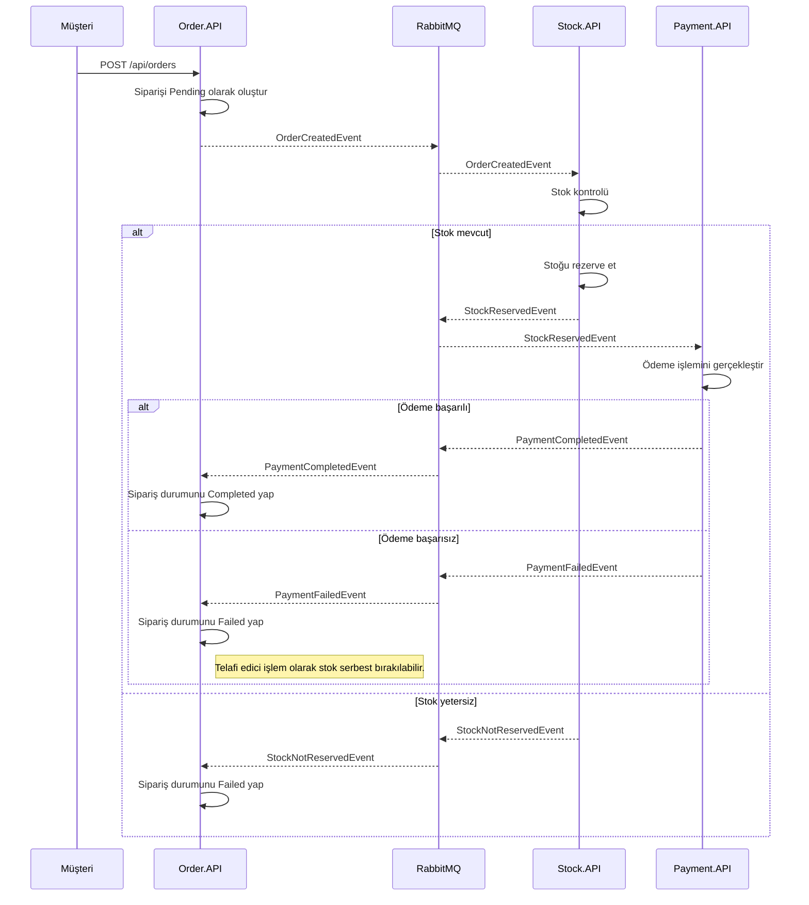

# Mikroservis İletişim Mimarisi ve Akış Kılavuzu

Bu doküman, e-ticaret sipariş sürecini simüle eden mikroservis projesinin iletişim mimarisini ve bileşenlerini açıklamaktadır. Proje, **Event-Driven Architecture (EDA)** ve **Saga Pattern (Choreography)** yaklaşımını kullanarak servisler arasında gevşek bağlı (loosely coupled), asenkron iletişim kurmaktadır.

---

# Genel Mimari

Proje aşağıdaki bileşenlerden oluşmaktadır:

- **Order.API**
  - Sipariş oluşturur.
  - Sipariş durumunu yönetir.
  - Ödeme veya stok sonucuna göre siparişi günceller.

- **Stock.API**
  - Sipariş geldiğinde stok kontrolü yapar.
  - Yeterli stok varsa stoğu rezerve eder.
  - Sonucu Event olarak yayınlar.

- **Payment.API**
  - Stok başarıyla ayrıldıktan sonra ödeme işlemini gerçekleştirir.
  - Başarılı veya başarısız sonucu Event olarak yayınlar.

- **Shared**
  - Tüm servislerin ortak kullandığı Event ve Message sınıflarını içerir.
  - Böylece servisler aynı kontrat üzerinden haberleşir.

- **RabbitMQ**
  - Mikroservisler arasındaki asenkron haberleşmeyi sağlayan Message Broker'dır.

---

# Saga Akışı

Aşağıdaki diyagram sipariş oluşturulduktan sonra servisler arasında gerçekleşen olay akışını göstermektedir.



---

# Olay (Event) Akışı

Projede servisler birbirlerini doğrudan çağırmaz.

Bunun yerine RabbitMQ üzerinden Event yayınlarlar.

Bu sayede servisler birbirlerinden bağımsız çalışabilir.

## 1) OrderCreatedEvent

Publisher

- Order.API

Consumer

- Stock.API

Açıklama

Yeni sipariş oluşturulduğunu bildirir.

---

## 2) StockReservedEvent

Publisher

- Stock.API

Consumer

- Payment.API

Açıklama

Stokların başarıyla ayrıldığını bildirir.

---

## 3) StockNotReservedEvent

Publisher

- Stock.API

Consumer

- Order.API

Açıklama

Yeterli stok bulunamadığını bildirir.

Sipariş Failed durumuna geçirilir.

---

## 4) PaymentCompletedEvent

Publisher

- Payment.API

Consumer

- Order.API

Açıklama

Ödemenin başarılı olduğunu bildirir.

Sipariş Completed durumuna geçirilir.

---

## 5) PaymentFailedEvent

Publisher

- Payment.API

Consumer

- Order.API

Açıklama

Ödemenin başarısız olduğunu bildirir.

Sipariş Failed durumuna geçirilir.

---

# Event Tablosu

| Event | Publisher | Consumer | Açıklama |
|--------|-----------|----------|----------|
| OrderCreatedEvent | Order.API | Stock.API | Sipariş oluşturulduğunu bildirir. |
| StockReservedEvent | Stock.API | Payment.API | Stok başarıyla ayrıldı. |
| StockNotReservedEvent | Stock.API | Order.API | Stok yetersiz. |
| PaymentCompletedEvent | Payment.API | Order.API | Ödeme başarılı. |
| PaymentFailedEvent | Payment.API | Order.API | Ödeme başarısız. |

---

# Consumer Yapısı

## Order.API

```
Consumers
├── PaymentCompletedEventConsumer.cs
├── PaymentFailedEventConsumer.cs
└── StockNotReservedConsumer.cs
```

### Görevleri

- PaymentCompletedEvent dinler.
- PaymentFailedEvent dinler.
- StockNotReservedEvent dinler.

Sipariş durumunu günceller.

---

## Stock.API

```
Consumers
└── OrderCreatedEventConsumer.cs
```

### Görevi

OrderCreatedEvent geldiğinde

- stok kontrolü yapar
- stok yeterliyse azaltır
- StockReservedEvent yayınlar
- değilse StockNotReservedEvent yayınlar.

---

## Payment.API

```
Consumers
└── StockReservedEventConsumer.cs
```

### Görevi

StockReservedEvent geldiğinde

- ödeme işlemini gerçekleştirir
- başarılıysa PaymentCompletedEvent yayınlar
- başarısızsa PaymentFailedEvent yayınlar.

---

# Shared Projesi

```
Shared
├── Events
│   ├── OrderCreatedEvent.cs
│   ├── StockReservedEvent.cs
│   ├── StockNotReservedEvent.cs
│   ├── PaymentCompletedEvent.cs
│   └── PaymentFailedEvent.cs
│
├── Messages
│   └── OrderItemMessage.cs
│
└── RabbitMQSettings
    └── RabbitMQSettings.cs
```

Bu proje tüm mikroservisler tarafından referans alınmaktadır.

Ortak Event tanımları burada bulunduğu için servisler aynı veri kontratı üzerinden haberleşmektedir.

---

# Kullanılan Tasarım Desenleri

- Microservice Architecture
- Event-Driven Architecture (EDA)
- Saga Pattern (Choreography)
- Publisher / Subscriber
- Message Broker (RabbitMQ)
- Consumer Pattern
- Dependency Injection
- Shared Contract Library

---

# Genel İş Akışı

```
Client
    │
    ▼
Order.API
    │
    ▼
RabbitMQ
    │
    ▼
Stock.API
    │
    ├───────────────┐
    │               │
    ▼               ▼
StockReserved   StockNotReserved
    │               │
    ▼               ▼
RabbitMQ      RabbitMQ
    │               │
    ▼               ▼
Payment.API    Order.API
    │
    ├───────────────┐
    │               │
    ▼               ▼
PaymentCompleted  PaymentFailed
    │               │
    ▼               ▼
RabbitMQ      RabbitMQ
    │               │
    └───────┬───────┘
            ▼
       Order.API
            │
            ▼
Sipariş Durumu Güncellenir
```

---

# Sonuç

Bu mimaride servisler birbirlerini doğrudan çağırmamaktadır. Tüm iletişim RabbitMQ üzerinden Event yayınlama ve Event tüketme mantığı ile gerçekleşmektedir. Böylece servisler birbirinden bağımsız geliştirilebilir, ölçeklenebilir ve gerektiğinde farklı teknolojiler kullanılarak yeniden yazılabilir. Bu yaklaşım, gerçek dünyadaki dağıtık mikroservis sistemlerinde yaygın olarak kullanılan **Saga (Choreography)** mimarisinin temel bir örneğidir.