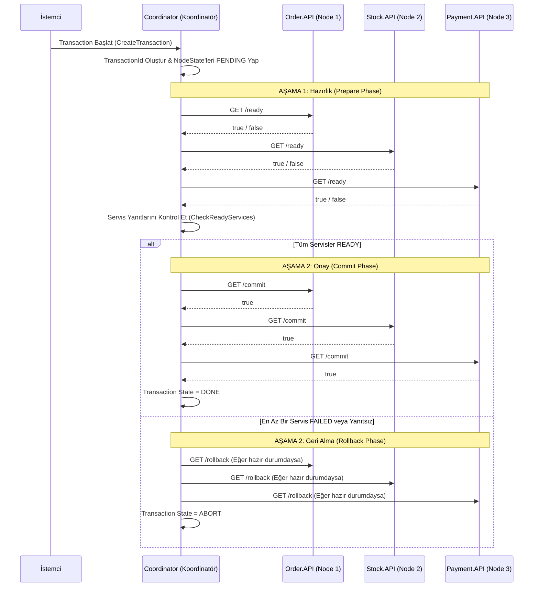

# Güçlü Tutarlılık (Two-Phase Commit 2PC) Mimarisi ve İletişim Akış Kılavuzu

Bu doküman, mikroservis mimarisinde **Güçlü Tutarlılık (Strong Consistency)** elde etmek amacıyla uygulanan **Two-Phase Commit (2PC)** protokolünün ve bileşenlerinin detaylı mimarisini açıklamaktadır.

---

# Genel Mimari

Two-Phase Commit (2PC) deseni, dağıtık sistemlerdeki tüm servislerin (Node'ların) bir işlemi ya hep birlikte onaylamasını (Commit) ya da hep birlikte iptal etmesini (Rollback) garanti altına alan merkezi bir koordinasyon protokolüdür.

Projede yer alan bileşenler:

- **Coordinator (Koordinatör Servis)**
  - Dağıtık transaction sürecini başlatır ve yönetir.
  - Tüm katılımcı servislerin (Node) durumlarını veritabanında (`TwoPhaseCommitContext` - SQLite) takip eder.
  - İki aşamalı karar (Prepare & Commit/Rollback) mantığını yürütür.

- **Order.API (Node 1)**
  - Sipariş işlemlerinden sorumlu katılımcı servistir.
  - Koordinatörden gelen `/ready`, `/commit` ve `/rollback` isteklerine yanıt verir.

- **Stock.API (Node 2)**
  - Stok işlemlerinden sorumlu katılımcı servistir.
  - Koordinatörün kontrol isteklerine göre stok hazırlığı ve onayını gerçekleştirir.

- **Payment.API (Node 3)**
  - Ödeme işlemlerinden sorumlu katılımcı servistir.
  - Koordinatörün isteklerine göre ödeme altyapısının hazır olup olmadığını kontrol eder.

---

# 2PC İki Aşamalı Akış Diyagramı



---

# 2PC Aşama ve Durum Tablosu

| Aşama (Phase) | İşlem | Açıklama |
|---------------|-------|----------|
| **Phase 1: Prepare** | `/ready` Çağrısı | Koordinatör tüm Node'lara hazır olup olmadıklarını sorar. Node'lar yerel kaynaklarını kilitler/kontrol eder. |
| **Phase 2: Commit** | `/commit` Çağrısı | Tüm Node'lar `READY` dönerse, koordinatör hepsine değişiklikleri kalıcı olarak kaydetme emri verir. |
| **Phase 2: Rollback** | `/rollback` Çağrısı | En az bir Node `FAILED` dönerse, koordinatör hazır olan servislerdeki işlemleri geri alır. |

---

# Veritabanı ve Durum (State) Yapısı

Koordinatör, transaction sürecini SQLite veritabanında saklanan `Node` ve `NodeState` modelleri üzerinden yönetir:

- **ReadyType Enumu**: `PENDING`, `READY`, `FAILED`
- **TransactionState Enumu**: `PENDING`, `DONE`, `ABORT`

```
Node (Order.API, Stock.API, Payment.API)
 └── NodeState (TransactionId, IsReady, TransactionState)
```

---

# Servis Endpoint Yapısı

Katılımcı servislerin (`Order.API`, `Stock.API`, `Payment.API`) sunması gereken temel HTTP endpoint'leri:

```
[Servis Base URL]
├── GET /ready     -> Servisin işleme hazır olup olmadığını döner (true/false)
├── GET /commit    -> Değişikliği veritabanına yansıtır (true/false)
└── GET /rollback  -> Yapılan işlemleri/kilitleri geri alır
```

---

# Kullanılan Tasarım Desenleri ve Teknolojiler

- **Two-Phase Commit (2PC) Pattern**
- **Coordinator Architecture**
- **Strong Consistency Model**
- **HttpClientFactory & Resilience Strategy**
- **Entity Framework Core (SQLite)**

---

# Sonuç

Two-Phase Commit (2PC) mimarisi, dağıtık sistemlerde **ACID** garantisi ve veri bütünlüğü sağlayan güçlü bir yöntemdir. Ancak servislerin birbirine senkron bağımlı olması ve kilitlenme (locking) maliyetleri nedeniyle yüksek performans gerektiren sistemlerde Saga gibi Eventual Consistency yaklaşımları tercih edilebilir.
