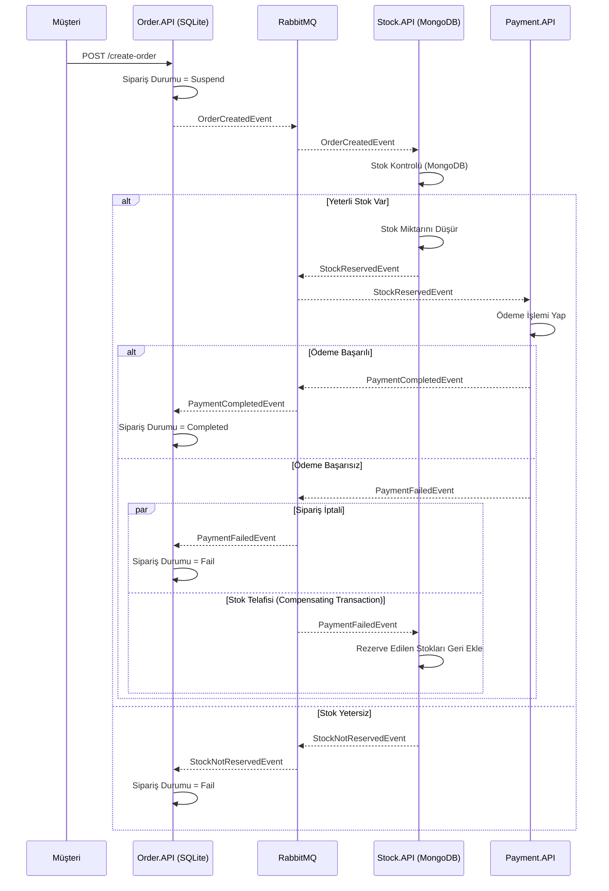

# Nihai Tutarlılık (Saga Choreography) Mimarisi ve İletişim Akış Kılavuzu

Bu doküman, e-ticaret sipariş sürecinde **Nihai Tutarlılık (Eventual Consistency)** sağlamak amacıyla uygulanan **Saga Choreography (Koreografi)** deseninin mimarisini ve servisler arası event akışını detaylandırmaktadır.

---

# Genel Mimari

Saga Koreografi yaklaşımında merkezi bir yönlendirici (Orchestrator) bulunmaz. Her mikroservis kendi sorumluluğundaki işlemi tamamlar ve bir sonraki adımı tetikleyecek **Event (Olay)** yayınlar. Bir hata durumunda ise **Telafi Edici İşlemler (Compensating Transactions)** çalıştırılarak sistem nihai tutarlılığa ulaştırılır.

Projedeki bileşenler:

- **Order.API** (SQLite DB)
  - Siparişi `Suspend` durumunda başlatır.
  - Ödeme ve stok sonuçlarına göre sipariş durumunu `Completed` veya `Fail` olarak günceller.

- **Stock.API** (MongoDB)
  - Stok bilgilerini MongoDB üzerinde yönetir.
  - `OrderCreatedEvent` geldiğinde stok kontrolü ve rezervasyonu yapar.
  - Ödeme başarısız olduğunda (`PaymentFailedEvent`) stokları geri yükleyerek **telafi edici işlemi** gerçekleştirir.

- **Payment.API**
  - `StockReservedEvent` geldiğinde ödeme alma simülasyonunu çalıştırır.
  - İşlem sonucuna göre `PaymentCompletedEvent` veya `PaymentFailedEvent` yayınlar.

- **Shared & RabbitMQ**
  - Tüm servisler MassTransit ve RabbitMQ üzerinden ortak kontratlar (`Shared`) vasıtasıyla asenkron haberleşir.

---

# Saga Koreografi Akış Diyagramı



---

# Olay (Event) & Consumer Matrisi

| Event | Yayınlayan (Publisher) | Tüketen (Consumer) | Yapılan İşlem / Telafi Mantığı |
|-------|------------------------|-------------------|--------------------------------|
| **OrderCreatedEvent** | `Order.API` | `Stock.API` | Sipariş oluşturuldu. Stok kontrolü yapılır. |
| **StockReservedEvent** | `Stock.API` | `Payment.API` | Stok ayrıldı. Ödeme çekme işlemi başlatılır. |
| **StockNotReservedEvent** | `Stock.API` | `Order.API` | Stok yetersiz. Sipariş durumu `Fail` yapılır. |
| **PaymentCompletedEvent** | `Payment.API` | `Order.API` | Ödeme alındı. Sipariş durumu `Completed` yapılır. |
| **PaymentFailedEvent** | `Payment.API` | `Order.API` & `Stock.API` | Ödeme alınamadı. Sipariş `Fail` yapılır ve **Stock.API stokları geri yükler (Compensating Transaction)**. |

---

# Proje Dizini Yapısı

```
3.EventualConsistencySagaChoreography/
├── Order.API/
│   ├── Consumers/ (PaymentCompletedConsumer, PaymentFailedEventConsumer, StockNotReservedEventConsumer)
│   └── Data/order.db
├── Stock.API/
│   ├── Consumers/ (OrderCreatedEventConsumer, PaymentFailedEventConsumer)
│   └── Services/MongoDBService.cs
├── Payment.API/
│   └── Consumers/ (StockReservedEventConsumer)
└── Shared/
    ├── Events/
    └── Messages/
```

---

# Kullanılan Tasarım Desenleri ve Teknolojiler

- **Eventual Consistency Model**
- **Saga Pattern (Choreography Variant)**
- **Compensating Transaction Pattern (Telafi Edici İşlem)**
- **MassTransit & RabbitMQ Message Broker**
- **Polyglot Persistence (SQLite & MongoDB)**
- **Shared Contract Library**

---

# Sonuç

Saga Koreografi deseni, merkezi bir bağımlılık (Single Point of Failure) oluşturmadan mikroservislerin event'ler üzerinden kendi kararlarını alarak çalışmasını sağlar. Hata durumlarında yayınlanan telafi event'leri (örneğin `PaymentFailedEvent` ile stokların iade edilmesi) sayesinde veri nihai olarak tutarlı (eventually consistent) kalır.
