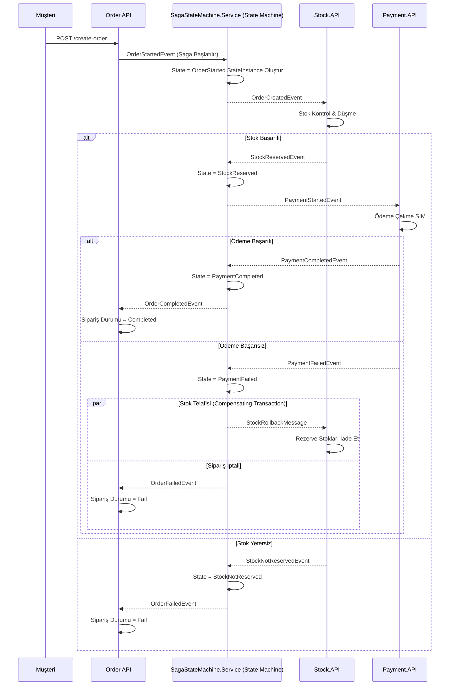

# Nihai Tutarlılık (Saga Orchestration) Mimarisi ve İletişim Akış Kılavuzu

Bu doküman, dağıtık mikroservis mimarisinde karmaşık iş süreçlerini ve durumu (State) merkezi bir yönlendirici servis üzerinden yönetmek amacıyla uygulanan **Saga Orchestration (Orkestrasyon)** deseninin mimarisini açıklamaktadır.

---

# Genel Mimari

Saga Orkestrasyon yaklaşımında, servisler birbiriyle doğrudan veya dolaylı event fırlatarak haberleşmez. Bunun yerine tüm durum geçişlerini, iş kurallarını ve hatada telafi işlemlerini yöneten merkezi bir **Saga State Machine (Orkestratör)** bulunur.

Projedeki temel bileşenler:

- **SagaStateMachine.Service (Orkestratör Servis)**
  - MassTransit State Machine (Automatonymous) ve EF Core (`OrderStateDbContext`) altyapısını kullanır.
  - Her bir sipariş için bir `OrderStateInstance` oluşturur ve durumunu (CurrentState) veritabanında saklar.
  - Hangi olay sonrasında hangi servise mesaj gönderileceğini tek noktadan yönetir.

- **Order.API**
  - Sipariş talebini alır ve `OrderStartedEvent` fırlatarak Saga sürecini başlatır.
  - State Machine'den gelen `OrderCompletedEvent` veya `OrderFailedEvent` mesajlarına göre siparişi günceller.

- **Stock.API**
  - State Machine'den gelen komut/event ile stok rezervasyonu yapar (`StockReservedEvent` veya `StockNotReservedEvent`).
  - Hata durumunda State Machine'den gelen `StockRollbackMessage` ile rezerve edilen stokları iade eder.

- **Payment.API**
  - State Machine'den gelen `PaymentStartedEvent` ile ödeme işlemini gerçekleştirir.
  - Sonucu `PaymentCompletedEvent` veya `PaymentFailedEvent` olarak State Machine'e bildirir.

---

# Saga Orkestrasyon Akış Diyagramı



---

# State Machine Durum Geçişleri (State Matrix)

| Başlangıç Durumu | Tetikleyen Olay (Event) | Sonraki Durum | Gönderilen Komut / Event |
|------------------|------------------------|---------------|--------------------------|
| **Initial** | `OrderStartedEvent` | `OrderStarted` | `Stock.API`'ye `OrderCreatedEvent` |
| **OrderStarted** | `StockReservedEvent` | `StockReserved` | `Payment.API`'ye `PaymentStartedEvent` |
| **OrderStarted** | `StockNotReservedEvent` | `StockNotReserved` | `Order.API`'ye `OrderFailedEvent` |
| **StockReserved** | `PaymentCompletedEvent` | `PaymentCompleted` | `Order.API`'ye `OrderCompletedEvent` |
| **StockReserved** | `PaymentFailedEvent` | `PaymentFailed` | `Stock.API`'ye `StockRollbackMessage` & `Order.API`'ye `OrderFailedEvent` |

---

# Proje Dizini Yapısı

```
4.EventualConsistencySagaOrchestration/
├── SagaStateMachine.Service/
│   ├── StateDbContexts/ (OrderStateDbContext.cs)
│   ├── StateInstances/ (OrderStateInstance.cs)
│   ├── StateMachines/ (OrderStateMachine.cs)
│   └── StateMaps/ (OrderStateMap.cs)
├── Order.API/
├── Stock.API/
│   └── Consumers/ (StockRollbackMessageConsumer.cs, OrderCreatedEventConsumer.cs)
├── Payment.API/
└── Shared/
    ├── OrderEvents/
    ├── StockEvents/
    ├── PaymentEvents/
    └── Messages/
```

---

# Kullanılan Tasarım Desenleri ve Teknolojiler

- **Saga Pattern (Orchestration Variant)**
- **State Machine Pattern (MassTransit Automatonymous)**
- **Compensating Transaction Pattern**
- **State Persistence (Entity Framework Core - SQL Server / SQLite)**
- **Message Broker (RabbitMQ)**

---

# Sonuç

Saga Orkestrasyon modeli, iş akışının ve telafi adımlarının merkezi bir State Machine üzerinden takip edilmesini sağlar. Koreografiye kıyasla süreç takibi, hata yönetimi ve durumsal görünürlük (observability) çok daha kolay ve yönetilebilirdir.
