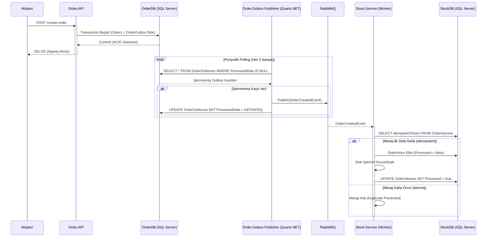

# Outbox & Inbox Pattern Mimarisi ve İletişim Akış Kılavuzu

Bu doküman, mikroservis mimarisinde güvenilir mesajlaşma (Reliable Messaging) ve aynı mesajın birden fazla işlenmesini önleme (Idempotency) amacıyla uygulanan **Transactional Outbox Pattern** ve **Inbox Pattern** mimarisini ve bileşenlerini detaylandırmaktadır.

---

# Genel Mimari ve Çözülen Problem

Dağıtık sistemlerde veri tabanına kayıt atılması ile Message Broker'a (RabbitMQ) event fırlatılması işlemlerinin aynı anda gerçekleşmesi durumunda **Dual Write Problem** ortaya çıkar. Eğer veritabanı işlemi başarılı olur fakat RabbitMQ erişilemezse event kaybolur.

Outbox ve Inbox desenleri bu sorunu ve tekrarlı mesaj işleme riskini çözer:

1. **Outbox Pattern (Order.API & Outbox Publisher)**
   - Sipariş ve `OrderOutbox` tablosuna kayıt **aynı veritabanı transaction'ı (ACID)** içerisinde atılır.
   - Ayrı bir arka plan servisi olan **`Order.Outbox.Table.Publisher.Service`** (Quartz.NET), veritabanındaki işlenmemiş outbox kayıtlarını periyodik olarak okur ve RabbitMQ'ya güvenle yayınlar.

2. **Inbox Pattern (Stock.Service)**
   - Tüketici servis (`Stock.Service`), gelen mesajı doğrudan işlemek yerine önce `OrderInboxes` tablosuna `IdempotentToken` ile kaydeder.
   - Aynı mesaj tekrar gelse bile token kontrolü sayesinde **tekrarlı işleme (Duplicate Processing)** engellenir ve **Idempotency** sağlanır.

---

# Outbox & Inbox Akış Diyagramı

---

# Bileşenler ve Görevleri

- **Order.API**
  - Sipariş isteğini alır.
  - Siparişi ve `OrderOutbox` nesnesini tek bir `DbContext.SaveChangesAsync()` çağrısı ile SQL Server'a kaydeder.

- **Order.Outbox.Table.Publisher.Service**
  - Worker Service yapısındadır ve Quartz.NET Scheduler barındırır.
  - `OrderOutboxPublishJob` ile `OrderOutboxes` tablosundaki `ProcessedDate IS NULL` olan satırları sorgular (Dapper ile).
  - Olayı RabbitMQ'ya publish ettikten sonra `ProcessedDate` alanını günceller.

- **Stock.Service**
  - `OrderCreatedEventConsumer` barındıran bir Worker Service'tir.
  - Gelen `OrderCreatedEvent` içindeki `IdempotentToken` değerini `OrderInboxes` tablosunda arar.
  - İşlenmemiş kayıtları işleyip `Processed = true` yapar.

- **Shared**
  - Ortak `OrderCreatedEvent`, `OrderItem` ve `.env` yükleyici `EnvLoader` bileşenlerini içerir.

---

# Tablo Şemaları

### OrderOutbox Tablosu (`Order.API` & `Publisher`)

| Kolon | Tip | Açıklama |
|-------|-----|----------|
| `IdempotentToken` | `Guid` (PK) | Benzersiz işlem anahtarı |
| `OccuredOn` | `DateTime` | Olayın gerçekleşme zamanı |
| `ProcessedDate` | `DateTime?` | Publisher tarafından işlenme tarihi (Null ise işlenmemiş) |
| `Type` | `string` | Event türünün adı (`OrderCreatedEvent`) |
| `Payload` | `string` | Event verisinin JSON serileştirilmiş hali |

### OrderInbox Tablosu (`Stock.Service`)

| Kolon | Tip | Açıklama |
|-------|-----|----------|
| `IdempotentToken` | `Guid` (PK) | Gelen event'in benzersiz token'ı |
| `Processed` | `bool` | Mesajın işlenip işlenmediği bilgisi |
| `Payload` | `string` | Gelen event JSON verisi |

---

# Kullanılan Tasarım Desenleri ve Teknolojiler

- **Transactional Outbox Pattern**
- **Inbox Pattern (Idempotent Consumer)**
- **Quartz.NET Job Scheduling**
- **Dapper ORM & Entity Framework Core**
- **MassTransit & RabbitMQ**
- **Worker Service Architecture**
- **Environment Configuration Loading (`EnvLoader`)**

---

# Sonuç

Outbox ve Inbox kalıpları, mikroservis mimarisinde **At-Least-Once Delivery** (En az bir kere teslimat) ve **Exactly-Once Processing** (Tam olarak bir kere işleme) ilkelerini garanti eder. Veritabanı ile mesaj kuyruğu arasındaki tutarsızlıkları tamamen ortadan kaldırır.
